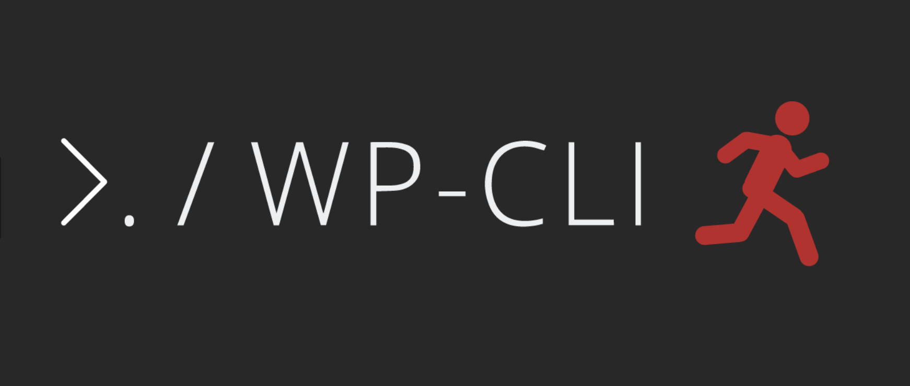

# Forbes

<p align="left">
  <a>
  </a>
  <a>
  </a>
  <a>
  </a>
</p>



## Description

Generate new project with webpack, no need more config for webpack.

## Usage

```sh

# install global
npm i -g forbes

# mkdir new Dir [Project-Name]
forbes install

```

## GIT REPO

```ts

git init                       # 初始化
git remote add origin ${YOUR REMOTE REPO-URL} #添加远程地址
# git remote set-url origin $URL # 设置当前仓库的远程地址到$URL 已弃用
git remote -v                  # 查看当前的远程仓库
git push                       # 推送到指定的repo

```
